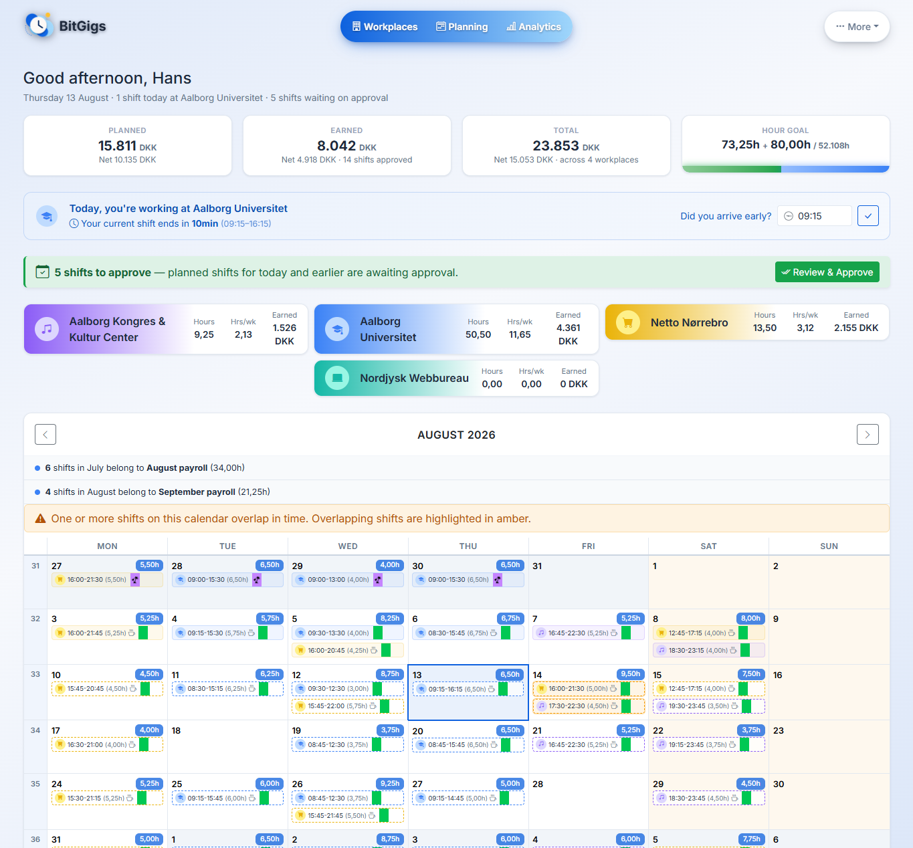
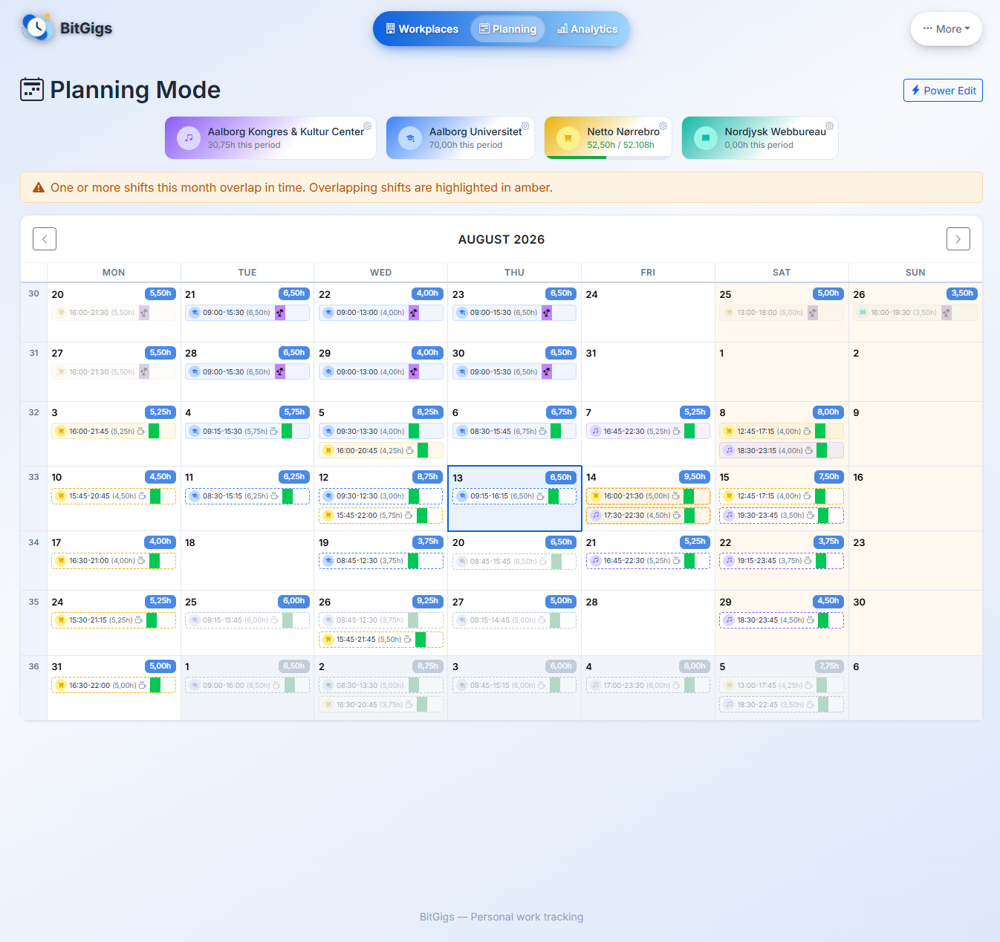
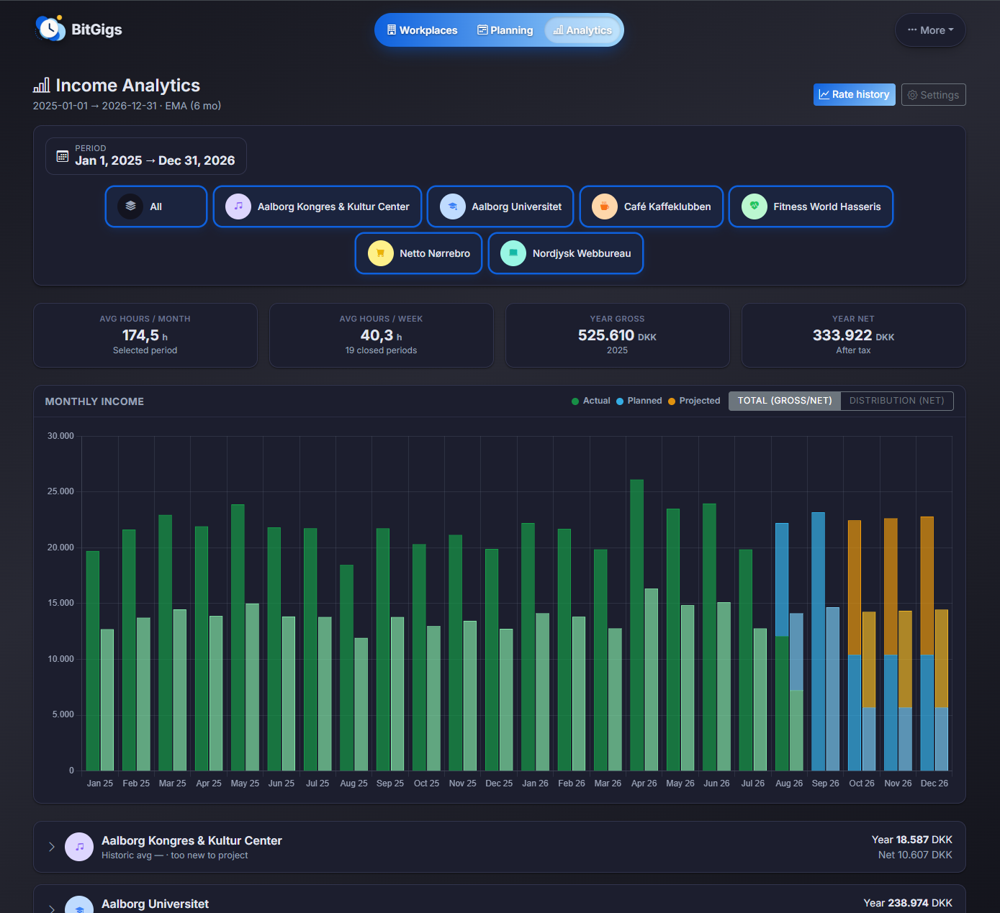
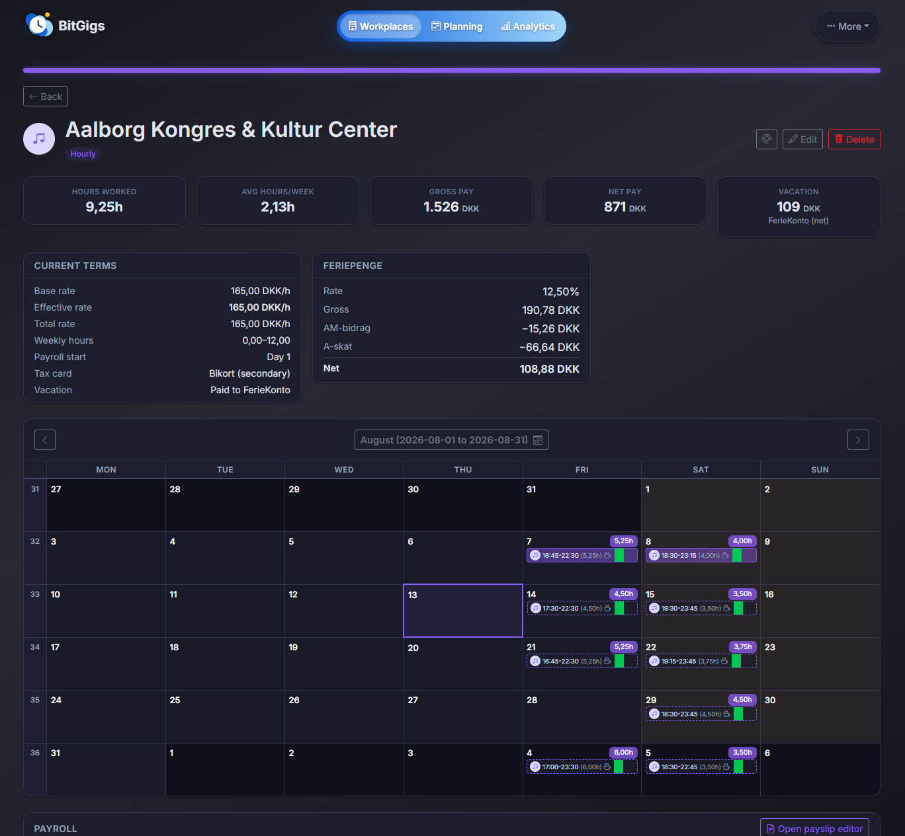

# BitGigs

BitGigs is an open-source Django web application for tracking work hours, estimating net pay, and managing shifts . built with Danish payroll rules in mind.

## Screenshots

**Dashboard** . the shift you are on right now, what is waiting to be approved, and the month so far across every job.



**Planning calendar** . every workplace in one month grid. Solid chips are approved, dashed ones are still planned, and the colour is the workplace.



**Income analytics** . what you have earned, what is already planned, and what the remaining periods are forecast to pay . each as its own band.



**Workplace** . each job's own page wears that job's accent colour, with its current terms, feriepenge and calendar.



BitGigs ships light and dark themes . the first two shots are light, the last two dark.

## Features

- **Multi-workplace support** . manage multiple jobs, each with its own employment type (hourly or salaried), payroll period, and appearance (custom icons and accent colours).
- **Shift tracking** . log work sessions as on-site, remote, sick leave, paid absence, or vacation, with start/end times and configurable break minutes.
- **Planned shifts** . draft and approve upcoming shifts before committing them as actual work sessions.
- **Danish tax calculations** . date-versioned tax profiles covering trækprocent, personfradrag, AM-bidrag, and kirkeskat ensure past payslips are never retroactively recalculated.
- **ATP contributions** . bracket-based ATP (Arbejdsmarkedets Tillægspension) employee/employer contribution calculations.
- **Payroll periods & payslip editor** . generates a full payslip with auto-calculated standard lines plus user-defined pre-tax and post-tax additions/deductions with drag-and-drop reordering.
- **Feriekonto, Fritvalgskonto & Pension** . dedicated tracking per workplace.
- **Calendar view** . visual month calendar showing shifts across all workplaces.
- **Commuting tracking** . counts on-site days per workplace per month for tax/transport purposes.

## Tech Stack

| Layer | Technology |
|---|---|
| Backend | Django 6.0 |
| Frontend | Bootstrap 5 (via django-crispy-forms) |
| Database (dev) | SQLite |
| Database (prod) | PostgreSQL |
| Python | 3.11+ |

## Getting Started

### 1. Clone the repository

```bash
git clone https://github.com/Peasniped/BitGigs.git
cd BitGigs
```

### 2. Create and activate a virtual environment

```bash
python -m venv .venv
# Windows
.venv\Scripts\activate
# macOS / Linux
source .venv/bin/activate
```

### 3. Install dependencies

```bash
pip install -r requirements.txt
```

### 4. Apply migrations and run the development server

The default local settings use SQLite . no database setup required.

```bash
python manage.py migrate --settings=bitgigs.settings.local
python manage.py createsuperuser --settings=bitgigs.settings.local
python manage.py runserver --settings=bitgigs.settings.local
```

Visit `http://127.0.0.1:8000/` in your browser.

### Demo data (optional)

To see the app with something in it . the screenshots above are this dataset .
fill the database with a generated two-year working life:

```bash
python manage.py seed_demo_data --settings=bitgigs.settings.local
```

Six workplaces, hourly and salaried, contracts that start, end and hand over,
mid-contract raises and an offset payroll period, with shifts running from ~19
months ago to the end of next month . so there is real history behind today,
planned work ahead, and forecast months after that. Sign in as
`demo@bitgigs.dk` / `Screenshot2026!`.

**It replaces everything in the database it is pointed at**, so it asks first
and prints which database that is. Point it somewhere harmless, not at a
database you care about.

### Developing against PostgreSQL (optional)

Dev defaults to SQLite. To use a local PostgreSQL instead, start the bundled
container and flip the dev database switch:

```bash
cp .env.example .env       # set POSTGRES_PASSWORD, uncomment DJANGO_DB=postgres
docker compose up db
python manage.py migrate --settings=bitgigs.settings.local
```

## Running with Docker

The repo ships a production-shaped stack — the app image (gunicorn + WhiteNoise,
hardened production settings) plus PostgreSQL. The app service uses the
pre-built image `ghcr.io/peasniped/bitgigs:latest`, so running it never
requires building the repo:

```bash
cp .env.example .env       # set DJANGO_SECRET_KEY and POSTGRES_PASSWORD
docker compose up
```

While the GHCR package is private, pulling needs a one-time
`docker login ghcr.io` with a read-only PAT (`read:packages`).

### Releasing the image (maintainers)

There is no CI — a release is built and pushed by hand. A locally built tag
also satisfies `docker compose up` without touching the registry, which is how
you test unpushed changes:

```bash
docker build -t ghcr.io/peasniped/bitgigs:latest .
docker push ghcr.io/peasniped/bitgigs:latest    # requires docker login ghcr.io
```

Visit `http://localhost:8000/`. First-run setup asks for the setup key, which is
printed to the app log: `docker compose logs app`. HTTPS enforcement defaults to
off in compose for local use; set `DJANGO_ENABLE_HTTPS=1` in `.env` when serving
behind a TLS-terminating reverse proxy. Media uploads and the setup key live in
the `instance` volume, the database in `pgdata`.

## Settings

The project ships with three settings modules under `bitgigs/settings/`:

| Module | Purpose |
|---|---|
| `base.py` | Shared settings for all environments |
| `local.py` | Development . SQLite, `DEBUG=True` |
| `production.py` | Production . PostgreSQL, `DEBUG=False` |

### Production environment variables

| Variable | Default | Description |
|---|---|---|
| `DJANGO_SECRET_KEY` | *(insecure placeholder)* | Django secret key . **must** be set in production |
| `DJANGO_ALLOWED_HOSTS` | *(empty)* | Comma-separated list of allowed hostnames |
| `POSTGRES_DB` | `bitgigs` | PostgreSQL database name |
| `POSTGRES_USER` | `bitgigs` | PostgreSQL username |
| `POSTGRES_PASSWORD` | *(empty)* | PostgreSQL password |
| `POSTGRES_HOST` | `localhost` | PostgreSQL host |
| `POSTGRES_PORT` | `5432` | PostgreSQL port |
| `LOG_LEVEL` | `INFO` | Level for BitGigs' own loggers and Django's. An unrecognised value falls back to `INFO`. (`DJANGO_LOG_LEVEL` is the old name and still works) |
| `LOG_FILE` | *(empty)* | Also write to this file (rotated at 2 MB, 5 kept). Relative paths resolve against the repo root. (`DJANGO_LOG_FILE` is the old name and still works) |

### Logging

BitGigs logs to the console, because both supported deployments already capture
it: `docker compose logs -f app` for the container, `journalctl -u bitgigs` for
the systemd units. Nothing extra is needed to read the log.

Lines look like this, with the severity coloured on a terminal (cyan debug,
green info, yellow warning, red error and worse) and left plain when the output
is a pipe or a file:

```
2026-08-13 09:45:47  INFO      [core.apps]               -> Using Loglevel: INFO (console)
2026-08-13 09:45:48  WARNING   [core.views]              -> Failed sign-in for admin@example.dk from 10.0.0.4
2026-08-13 09:45:52  ERROR     [workplaces.services]     -> Could not prune orphaned icons
```

The severity and the source name are both padded to a fixed width, so the
messages line up into one column however long the source names are.

`LOG_LEVEL` (default `INFO`) covers BitGigs' own apps *and* Django's own loggers
— `django.server`'s request lines, the autoreloader — so `WARNING` gives a quiet
startup and `DEBUG` a detailed one. Third-party libraries are held at `WARNING`
either way, so their routine chatter never buries it, and SQL logging is the one
thing `DEBUG` does *not* switch on (a line per query would bury everything else).
Whichever level is in force is logged at that level on startup, so you can always
see which one took, along with which process is reporting and whether the value
came from `.env`, the environment, or the built-in default. Set `LOG_FILE` as
well if you want a file on disk — under Docker, point it inside the `instance`
volume (`LOG_FILE=instance/bitgigs.log`) so it survives a container replacement.

Worth knowing what lands there: failed and successful sign-ins (with the client
address), mail sends that the server refused, a stored secret that can no longer
be decrypted because `DJANGO_SECRET_KEY` changed, scheduler job and task
failures, and calendar feeds that could not be parsed.

## Project Structure

```
bitgigs/              # Project settings (base/local/production) and root URL config
apps/                 # Feature apps . a plain directory on sys.path, not a package
  core/               # Tax profiles, ATP configuration, settings page, dashboard
  workplaces/         # Workplaces, contracts and date-versioned pay terms
  shifts/             # Approved and planned shifts
  payroll/            # Payroll periods, payslip lines and payslip editor
  calendar_view/      # Month calendar across all workplaces, planning and approval
  calendar_sync/      # Calendar subscriptions in, calendar invites out
  analytics/          # Income projection and rate history
  data_io/            # Import and export
  help/               # Built-in manual and context-aware help popup
  api/                # Read-only HTTP API under /api/v1/
  scheduler/          # Background job and task scheduler
assets/               # Project-level templates/ and static/ (css, js, graphics)
instance/             # Runtime state . database, uploaded media, setup key
```

## Running Tests

```bash
python manage.py test apps --settings=bitgigs.settings.local
```

The `apps` label is required: `apps/` is a plain directory on `sys.path` rather
than a package, so an unqualified `manage.py test` discovers nothing.

## License

This project is licensed under the terms of the [LICENSE](LICENSE) file.


